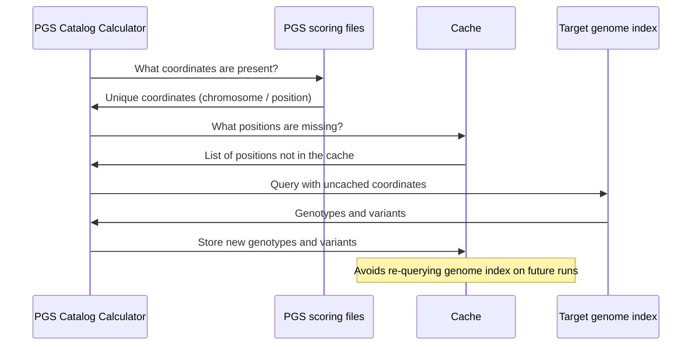

# The genotypes cache

## Background

When you run the PGS Catalog Calculator cached variants and genotypes are automatically published to the results directory in a file called `genotypes.zarr.zip`.

For example, if you've previously calculated [PGS001229](https://www.pgscatalog.org/score/PGS001229/) the cache will contain around 51,000 variants.

Polygenic scores for different traits may contain these variants, but with different effect weights assigned. Using the cache means that these variants don't need to be queried on future runs, saving [time and energy 🌳](https://www.green-algorithms.org/)

## Loading process sequence diagram

The cache is used to calculate polygenic scores during the scoring process.

:::tip How to use the genotype cache

Check out [the guide on how to use the genotype cache](../howto/cache.md)

:::
