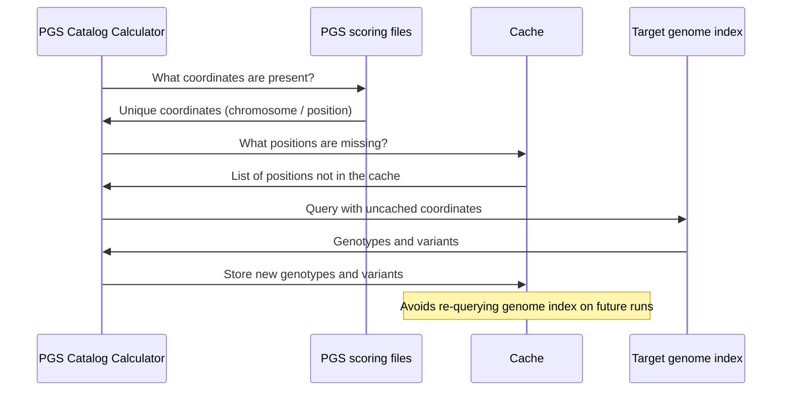

# The genotypes cache

## What the cache is helpful for ✅

:::tip Exploratory data analysis

* If you aren't sure what scores you plan to calculate before you start then using the cache can save both time and energy 🌳
* In this case you might be exploring your data, running multiple PGS scorefiles on the same target genome files iteratively
* The cache improves performance by avoiding redundant work on variants shared across scorefiles. Many scoring files include overlapping variant sets (e.g. [HapMap3 variants](https://doi.org/10.1371/journal.pgen.1009021)), even when their effect weights differ.
* With caching enabled, the workflow can skip redundant index queries and parsing previously seen variants

:::

## What the cache doesn't help ❌

:::danger Calculating many scores in parallel

* If you know before you start that you want to calculate many scores **it's always fastest to run the workflow once, specifying multiple scores at runtime**
* This is because scores are calculated in parallel automatically
* Calculating one score many times will be much slower than setting multiple scoring files once

:::

:::danger Calculating a score on non-overlapping target genomes

* If you use case is to calculate one PGS on many different target genomes which don't share samples, the cache will:
    * not provide any speedup
    * waste storage space on your computer
* In this case it can be better to set `--publish_cache false`

:::

## Loading process sequence diagram

The cache is then used during the `PGSC_CALC SCORE` process.

:::tip How to use the genotype cache

Check out [the guide on how to use the genotype cache](../howto/cache.md)

:::
