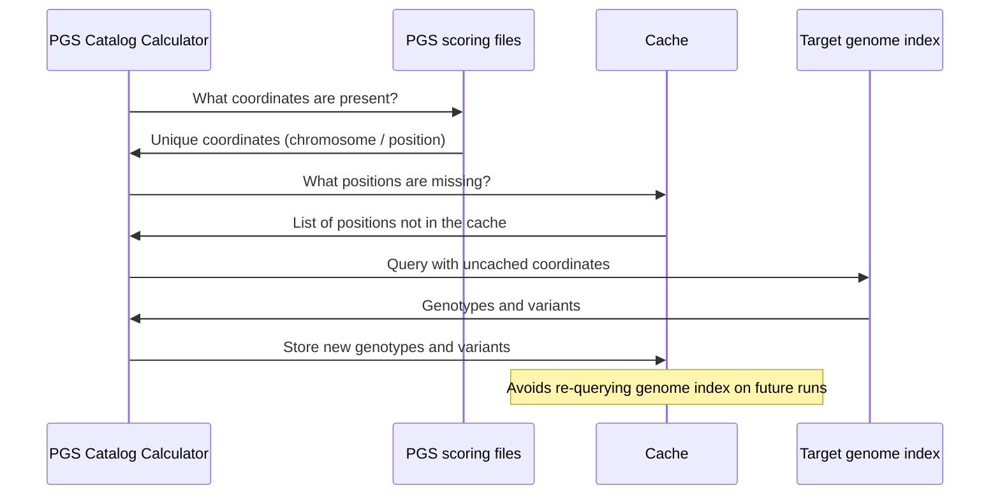

# The genotypes cache

## What the cache is helpful for ✅

* Many variants occur across multiple scoring files PGS scoring files [(like HapMap3)](https://doi.org/10.1371/journal.pgen.1009021), although they have different weights associated with each effect allele
* The cache can speed up repeated calculations of **different PGS on the same set of files** by skipping both redundant index queries and parsing previously seen variants
* The speed up affects the `PGSC_CALC LOAD` processes, helping to save [time and energy 🌳](https://www.green-algorithms.org/)

## What the cache doesn't help ❌

* If you use case is to calculate one PGS on many different target genomes, the cache will:
    * not provide any speedup
    * waste storage space on your computer
* In this case it can be better to set `--publish_cache false`

## Loading process sequence diagram

The cache is then used during the `PGSC_CALC SCORE` process.

:::tip How to use the genotype cache

Check out [the guide on how to use the genotype cache](../howto/cache.md)

:::
