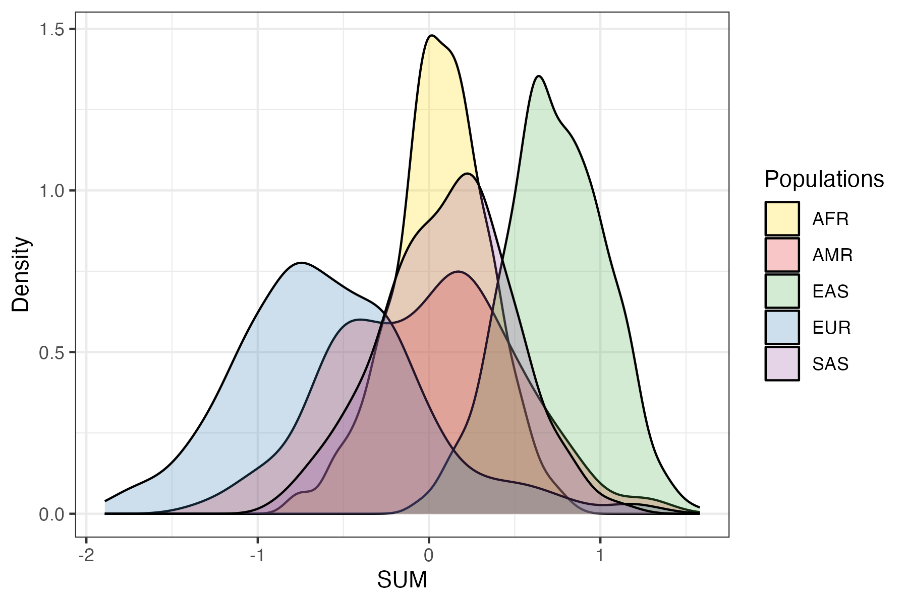
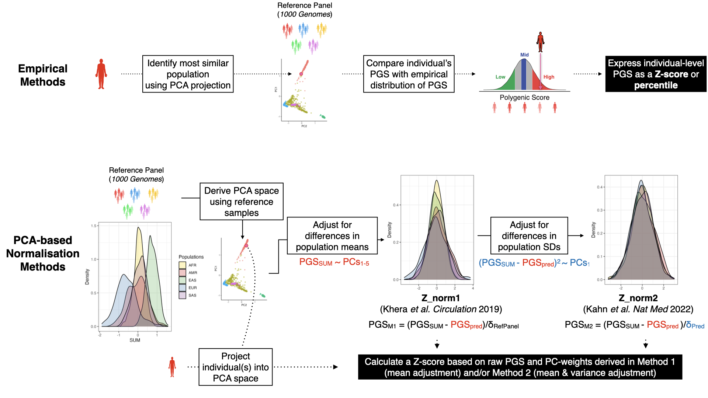

.. _norm:

Reporting and adjusting PGS in the context of genetic ancestry
==============================================================

v2 of the ``pgsc_calc`` pipeline introduces the ability to analyse the genetic ancestry of the individuals in your
sampleset in comparison to a reference panel (default: 1000 Genomes) using principal component analysis (PCA). In this
document we explain how the PCA is derived, and how it can be used to report polygenic scores that are adjusted or
contextualized by genetic ancestry using multiple different methods.

Motivation: PGS distributions and genetic ancestry
--------------------------------------------------
PGS are developed to measure an individual’s genetic predisposition to a disease or trait. A common way to express this
is as a relative measure of predisposition (e.g. risk) compared to a reference population (often presented as a Z-score
or percentile). The choice of reference population is important, as the mean and variance of a PGS can differ between
different genetic ancestry groups (`Figure 1`_) as been shown previously. [#Reisberg2017]_ [#Martin2017]_

.. _Figure 1:

    **Figure 1. Example of a PGS with shifted distributions in different ancestry groups.** Shown
    here is the distribution of PGS000018 (metaGRS_CAD) calculated using the SUM method
    in the 1000 Genomes reference panel, stratified by genetic ancestry groups (superpopulation labels).

It is important to note that differences in the means between different ancestry groups do not necessarily correspond
to differences in the risk (e.g., changes in disease prevalence, or mean biomarker values) between the populations.
Instead, these differences are caused by changes in allele frequencies and linkage disequilibrium (LD) patterns between
ancestry groups. This illustrates that the genetic ancestry is important for determining the relative risk, and multiple
methods that can account for these differences have been implemented within the pgsc_calc pipeline.

Methods for reporting and adjusting PGS in the context of ancestry
------------------------------------------------------------------
.. _adjustment methods:

When a PGS is being applied to a genetically homogenous population (e.g. cluster of individuals of similar genetic
ancestry), then the standard normalization is to normalize the calculated PGS using the sample mean and standard
deviation. This can be performed by running pgsc_calc and taking the Z-score of the PGS SUM. However, wish to adjust
the score to remove the effects of genetic ancestry on score distributions than the ``--run_ancestry`` method can
combine your PGS with a reference panel of individuals (default 1000 Genomes) and adjusted using multiple methods
(`Figure 2`_). These methods both start by creating a PCA of the reference panel, and projecting individual(s) genotypes
into the genetic ancestry space to determine their placement. The two groups of methods (empirical and continuous
PCA-based) use these data and the calculated PGS to report the PGS and we describe them below.

.. _Figure 2:

    **Figure 2. Schematic figure detailing empirical and PCA-based methods for contextualizing or adjusting PGS
    with genetic ancestry.** Data is for the normalization of PGS000018 (metaGRS_CAD) in 1000 Genomes,
    when applying ``pgsc_calc --run_ancestry`` to data from the Human Genome Diversity Project (HGDP) data.

Empirical methods
~~~~~~~~~~~~~~~~~
A common way to report the relative PGS for an individual is by comparing their score with a distribution
of scores from genetically similar individuals (similar to taking a Z-score within a genetically homogenous population
above). [#ImputeMe]_ To define the correct reference distribution of PGS for an individual we first train a classifier
to predict the population labels (pre-defined ancestry groups from the reference panel) using PCA loadings in the
reference panel. This classifier is then applied to individuals in the target dataset to identify the population they are
most similar to in genetic ancestry space. The relative PGS for each individual is then calculated by comparing the
calculated PGS to the distribution of PGS in the most similar population in the reference panel and reporting it as a
percentile (output column: ``percentile_MostSimilarPop``) or by taking a Z-score (output column: ``Z_MostSimilarPop``).

PCA-based methods
~~~~~~~~~~~~~~~~~
A second way to remove the effect of genetic ancestry on PGS distributions is to treat ancestry as a continuum
(represented by loadings in PCA-space) and use regression to adjust for shifts therein. Using regression has the
benefit of not assigning individuals to specific ancestry groups, which may be particularly problematic for empirical
methods when an individual has an ancestry that is not represented within the reference panel. This method was first
proposed by Khera et al. (2019) [#Khera2019]_ and uses the PCA loadings to adjust for differences in the means of PGS
distributions across ancestries by fitting a regression of PGS values based on PCA-loadings of individuals of the
reference panel. To calculate the normalized PGS the predicted PGS based on the PCA-loadings is subtracted from the PGS
and normalized by the standard deviation in the reference population to achieve PGS distributions that are centred
at 0 for each genetic ancestry group (output column: ``Z_norm1``) while not relying on any population labels during
model fitting.

The first method (``Z_norm1``)  has the result of normalizing the first moment of the PGS distribution (mean); however,
the second moment of the PGS distribution (variance) can also differ between ancestry groups. A second regression of
the PCA-loadings on the squared residuals (difference of the PGS and the predicted PGS) can be fit to estimate a
predicted standard deviation based on genetic ancestry, as was proposed by Khan et al. (2022). [#Khan2022]_  The
predicted standard deviation (distance from the mean PGS based on ancestry) is used to normalize the residual PGS and
get a new estimate of relative risk (output column: ``Z_norm2``) where the variance of the PGS distribution is more
equal across ancestry groups and approximately 1.

Implementation of ancestry steps within ``pgsc_calc``
-----------------------------------------------------
The ancestry methods are implemented within the `--run_ancestry` method of the pipeline (:ref:`ancestry`), and has the
following steps:

1. **Reference panel** (see :ref:`database` for details).

2. **Variant overlap**: Identifying variants that are present in both the target genotypes and the reference panel. Uses
    the ``INTERSECT_VARIANTS`` module.

3. **PGS Calculation**:
    1. **Preparing scoring files**: in order to normalize the PGS the score has to be calculated on identical variant sets both datasets.
        The list of overlapping variants between the reference and target datasets are supplied to the ``MATCH_COMBINE``
        module to exclude scoring file variants that are matched only in the target genotypes.

    2. **PGS Scoring**: the scoring files are the supplied to the ``PLINK2_SCORE`` module, along with allele frequency
        information from the reference panel to ensure consistent scoring of the PGS SUMs across datasets. The scoring
        is made efficient by scoring all PGS in parallel.

4. **PCA of the reference panel**
    1. **Preparing reference panel for PCA**: the refrence panel is filtered to unrelated samples with standard filters
        for variant-level QC (SNPs in Hardy–Weinberg equilibrium [p > 1e-06] that are bi-allelic and non-ambiguous,
        with low missingness [<10%], and minor allele frequency [MAF > 1%]) and sample-quality (missingness [<10%]).
        LD-pruning is then applied to the variants and sample passing these checks (r2 threshold = 0.05) and exclusion
        of complex regions with high LD (e.g. MHC) dependant on the target genome build. These methods are implemented
        in the ``FILTER_VARIANTS`` module.

    2. **PCA**: the LD-pruned variants of the unrelated samples passing QC are then used to define the PCA space of the
        reference panel (default: 10 PCs) using `FRAPOSA`_ (Fast and Robust Ancestry Prediction by using Online singular
        value decomposition and Shrinkage Adjustment). [#zhangfraposa]_ This is implemented in the ``FRAPOSA_PCA``
        module.

5. **Projecting target samples into the reference PCA space**: the PCA of the reference panel (variant-PC loadings, and
    reference sample projections) are then used to determine the placement of the target samples in the PCA space using
    projection. Naive projection (using loadings) is prone to shrinkage which biases the projection of individuals
    towards the null of an existing space, which would introduce errors into PCA-loading based adjustments of PGS. To
    ensure correct placement of individuals we use the **online augmentation, decomposition and Procrustes (OADP)**
    method of the `FRAPOSA`_ package to achieve a unbiased projection of new indidividuals into the reference panel PCA
    space. [#zhangfraposa]_ We chose to implement PCA-based projection over derivation of the PCA space on a merged
    target and reference dataset to ensure that the composition of the target doesn't impact the structure of the PCA.
    This is implemented in the ``FRAPOSA_OADP`` module.

6. **Ancestry analysis**: the calculated PGS (SUM), reference panel PCA, and target sample projection into the PCA space
    are supplied to an analysis script that performs the analyses needed to adjust the PGS for genetic ancestry. This
    functionality is implemented within the ``ANCESTRY_ANALYSIS`` module and tool of our `pgscatalog_utils`_ package,
    and includes:

    1. **Genetic similarity analysis**: first each indvidual in the target sample is compared to the reference panel to
        determine the population that they are most genetically similar to. By default this is done by fitting a
        RandomForest classifier to predict reference panel population assignments using the PCA-loadings (default:
        10 PCs) and then applying the classifier to the target samples to identify the most genetically similar
        population in the reference panel (e.g. highest-probability). Alternatively, the Mahalanobis distance between
        each individual and each reference population can be calculated and used to identify the most similar reference
        population (minimum distance). The probability of membership for each reference population and most similar
        population assignments are recorded and output.

    2. **PGS adjustment**: the results of the genetic similarity analysis are combined with the PCA-loadings and
        calculated PGS to perform the `adjustment methods`_ described in the previous section. To perform the
        **empirical adjusments** (``percentile_MostSimilarPop``, ``Z_MostSimilarPop``) the PGS and the population
        labels are used. To perform the **PCA-based adjusments** only the PGS and PCA-loadings are used.

7. **Reporting & Outputs**: the final results are output to txt files for further analysis, and an HTML report with
    visualizations of the PCA data and PGS distributions (see :ref:`interpret`_ for additional details).

.. _`FRAPOSA`: https://github.com/PGScatalog/fraposa_pgsc
.. _`pgscatalog_utils`: https://github.com/PGScatalog/pgscatalog_utils

Interpretation of PGS-adjustment data from ``pgsc_calc``
--------------------------------------------------------

.. rubric:: Citations
.. [#Reisberg2017] Reisberg S, et al. (2017) Comparing distributions of polygenic risk scores of type 2 diabetes and coronary heart disease within different populations. PLoS ONE 12(7):e0179238. https://doi.org/10.1371/journal.pone.0179238
.. [#Martin2017] Martin, A.R., et al. (2017) Human Demographic History Impacts Genetic Risk Prediction across Diverse Populations. The American Journal of Human Genetics 100(4):635-649. https://doi.org/10.1016/j.ajhg.2017.03.004
.. [#ImputeMe] Folkersen, L., et al. (2020) Impute.me: An Open-Source, Non-profit Tool for Using Data From Direct-to-Consumer Genetic Testing to Calculate and Interpret Polygenic Risk Scores. Frontiers in Genetics 11:578. https://doi.org/10.3389/fgene.2020.00578
.. [#Khera2019] Khera A.V., et al. (2019) Whole-Genome Sequencing to Characterize Monogenic and Polygenic Contributions in Patients Hospitalized With Early-Onset Myocardial Infarction. Circulation 139:1593–1602. https://doi.org/10.1161/CIRCULATIONAHA.118.035658
.. [#Khan2022] Khan, A., et al. (2022) Genome-wide polygenic score to predict chronic kidney disease across ancestries. Nature Medicine. https://doi.org/10.1038/s41591-022-01869-1
.. [#zhangfraposa] Zhang, D., et al. (2020) Fast and robust ancestry prediction using principal component analysis. Bioinformatics 36(11):3439–3446. https://doi.org/10.1093/bioinformatics/btaa152