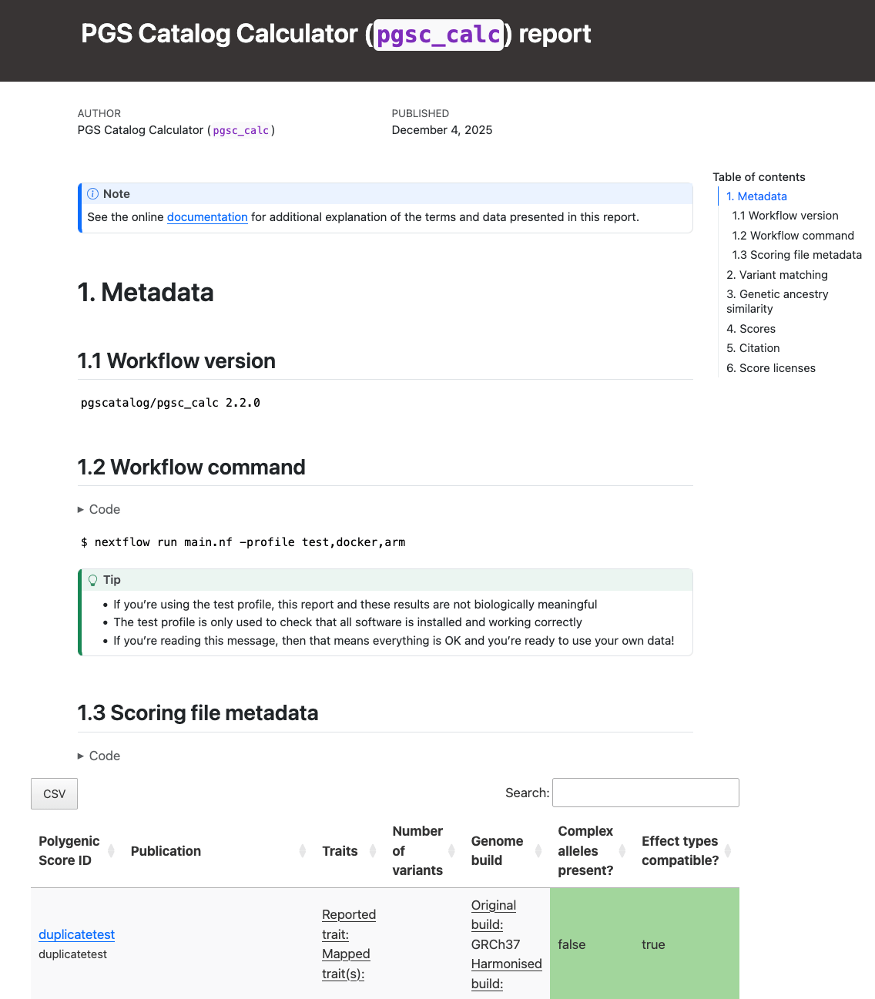
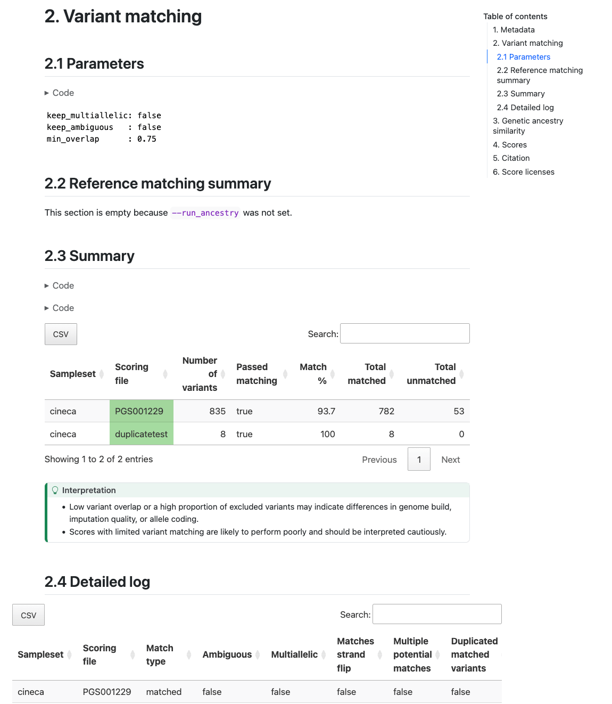
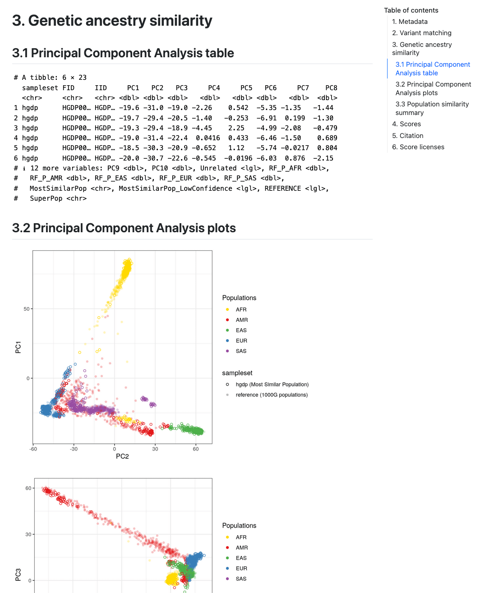
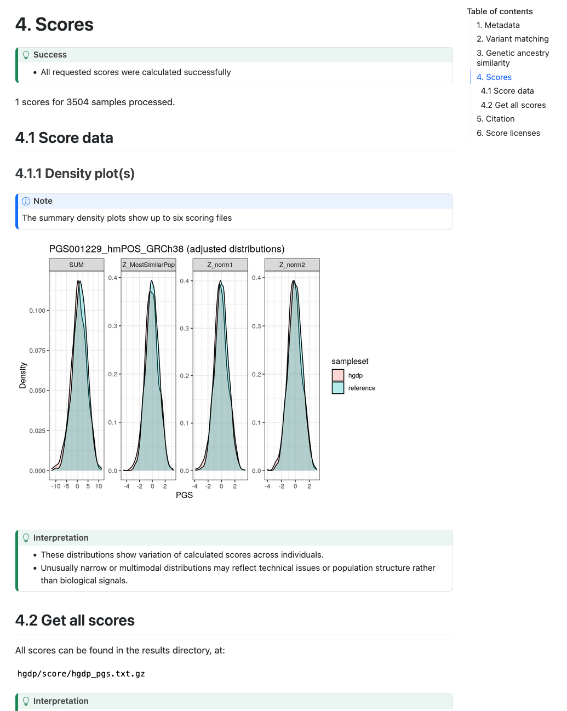

.. _interpret:

``pgsc_calc`` Outputs & report
==============================

This page provides detailed technical documentation for all outputs
produced by the PGS Catalog Calculator (pgsc_calc). It describes the
structure and content of each file generated by the pipeline.

For further guidance on how to interpret the results, including
understanding variant matching statistics, ancestry adjustments, score
distributions, and uncertainty in PGS estimation, please refer to the
companion :doc:`interpretation guide <interpret>`.

Overview
--------

The PGS Catalog Calculator (pgsc_calc) generates a structured set of
outputs designed to make PGS analyses transparent, reproducible, and
interpretable. All output files are written to a results directory
(``--outdir``, default ``./results/``) with the following structure:

.. code-block:: console

    results
    ├── [sampleset name]
    │   ├── match
    │   └── score
    └── pipeline_info

* **[sampleset name]** will change depending on the name of your samplset, it's the directory with results for your data
* **match** contains processed scoring files and information on how variants in the scoring files match with variants in the target
* **score** contains individual level calculated scores and a summary report
* **pipeline_info** contains nextflow pipeline execution data

See below for a list of all files generated after running the test profile:

.. code-block:: console

    results
    ├── [sampleset name]
    │   ├── match
    │   │   ├── [sampleset name]_22_additive_0.scorefile.gz
    │   │   ├── [sampleset name]_22_additive_1.scorefile.gz
    │   │   ├── [sampleset name]_log.csv.gz
    │   │   ├── [sampleset name]_summary.csv
    │   │   └── versions.yml
    │   └── score
    │       ├── aggregated_scores.txt.gz
    │       ├── report.html
    │       └── versions.yml
    └── pipeline_info
        ├── execution_report_2025-12-03_14-54-45.html
        ├── execution_timeline_2025-12-03_14-54-45.html
        ├── execution_trace_2025-12-03_14-54-45.txt
        ├── manifest_2025-12-03_14-54-45.bco.json
        ├── params_2025-12-03_14-56-25.json
        ├── pipeline_dag_2025-12-03_14-54-45.html
        └── software_versions.yml

Each component contributes to the overall reproducibility and interpretability of the analysis.

Report
------

A summary report is also provided for your samples
(``report.html``). The report should open in a web browser and contains
useful information about the PGS that were applied, how well the
variants in your target dataset match with the reference panel and
scoring files, a summary of the computed genetic ancestry data, and
some simple graphs displaying the distribution of scores in your
dataset(s) as a density plot. Some of the sections are only displayed
with ``--run_ancestry``, but we show them all here for reference.

.. note:: **Interpretation**

    The HTML report is designed to give a quick overview of data quality
    and interpretability:

    * Variant matching tables help assess whether a PGS is suitable for your dataset. Low overlap suggests limited reliability.
    * Ancestry plots show target samples in reference PCA space. Large outliers may reflect misclassified samples or genotyping/imputation issues.
    * PGS distribution plots display population-level variation and can reveal technical artefacts or calibration issues.

    Use these visual summaries to verify score validity before using results in downstream analyses.

Example reports of the :download:`the test profile
<../_static/test_report.html>` and :download:`ancestry analysis
<../_static/example_report.html>` are available to view. The test
profile is described in :doc:`getting started  <../getting-started>`.

**Section 1 (Metadata)** of the report reproduces the nextflow command, and scoring file metadata (imported from the PGS Catalog for each PGS ID) describing the scoring files that were applied to your sampleset(s):

    **Report Section 1 (Metadata).**

**Section 2 (Variant matching)** reports how the variants in the target
sampleset match the variants in the scoring files. The table in Section 2.2 ("Reference matching summary")
describes the number of variants in the target dataset that overlap
with the reference panel (only present with ``--run_ancestry``). The table in section 2.3 ("Summary") provides a summary of the number and percentage of variants within
each score that have been matched, and whether that score passed the
``--min_overlap`` threshold (Passed Matching column) for
calculation. The table in Section 2.4 ("Detailed log") provides a more detailed log of variant matches
broken down by types of variants (e.g., strand ambiguous,
multiallelic, duplicates) for the matched, excluded, and unmatched
variants (see match/ section for details):

    **Report Section 2 (Variant Matching) Example of variant matching summaries in the pgsc_calc report.**

**Section 3 (Genetic Ancestry/Similarity)** describes the results of the
genetic ancestry analysis of the target genotypes with the reference
panel data. It first displays a snippet of the
``[sampleset]_popsimilarity.txt.gz`` file for reference in a table in Section 3.1 ("Principal Component Analysis table"). A visual
display of the projection of the target data into the reference panel
PCA space is plotted for the first 6 PCs in Section 3.2 ("Principal Component Analysis plots"), where the target samples are
coloured according to the population that they are most similar to in
the reference panel. A table in Section 3.3 ("Population similarity summary") describing the distribution of ancestries
within the reference panel and proportions of the target samples who
are most similar to those populations is also provided.

    **Report Section 3 (Genetic Ancestry Similarity). Visualisation of genetic ancestry analysis.**

.. note:: **Interpretation**

    It is important to visually inspect the PCA to make sure that it looks correct (placing the reference populations correctly), and that the projection of individuals from the target dataset looks sensible.

**Section 4 (Scores)** describes the number of scores that were calculated
successfully. In Section 4.1.1 ("Density plot(s)") a visual display of the PGS distribution for a set of
example score(s) (up to 6) is provided in the Density plot panel which
can be helpful for looking at the distributions of the scores in the
target and reference dataset and how it changes for difference PGS
adjustment methods:

    **Example scores section including plots of PGS distributions.**

Plots are only created in the report if 50 or more samples are present in the target genomes.

``score/``
----------

Calculated scores are stored in a gzipped-text space-delimited text file called
``[sampleset]_pgs.txt.gz``. The data is presented in long form where each PGS for an individual is presented on a
separate row (``length = n_samples*n_pgs``), and there will be at least four columns with the following headers:

- ``sampleset``: the name of the input sampleset, or ``reference`` for the panel.
- ``FID``: the family identifier of each sample within the dataset (may be the same as IID).
- ``IID``: the identifier of each sample within the dataset.
- ``PGS``: the accession ID of the PGS being reported.
- ``SUM``: reports the weighted sum of *effect_allele* dosages multiplied by their *effect_weight*
  for each matched variant in the scoring file for the PGS.

If you have run the pipeline **without** using ancestry information the following columns may be present:

- ``DENOM``: the number of non-missing genotypes used to calculate the PGS for this individual.
- ``AVG``: normalizes ``SUM`` by the ``DENOM`` field (displayed when you calculate the PGS on a small sample size n<50
  to avoid using unreliable allele frequency estimates for missing genotypes in the target sample.

.. note:: The PGS ``SUM`` & ``AVG`` are rounded to a precision of 6 decimal places in the ouput of the PLINK2_SCORE
    commands; however, the calculation of the PGS is based on the full precision of the effect_weight value in the
    scoring file.

.. note:: **Interpretation**

    Low variant coverage or mismatched genome builds can introduce substantial uncertainty, so users should verify variant matching before interpreting results.
    If your samples all come from a homogenous ancestry group higher scores indicate greater genetic liability relative to others in the same dataset. This can be standardised (Z-score) to report relative genetic predisposition. If your samples are multi-ancestry then ancestry-adjusted scores should be calculated (--run_ancestry) to calculate relative genetic predisposition that is less confounded by ancestry.

.. warning:: Users should take note of whether the input samples were used in the development of the PGS being
    scored as this can lead to inflated estimate of PGS performance (see `Wray et al. (2013)`_ for discussion).

.. _Wray et al. (2013): https://www.ncbi.nlm.nih.gov/pmc/articles/PMC4096801/

``--run_ancestry``-specific outputs
~~~~~~~~~~~~~~~~~~~~~~~~~~~~~~~~~~~

If you have run the pipeline **using ancestry information** (``--run_ancestry``) the following columns may be present
in the ``[sampleset]_pgs.txt.gz`` file depending on the ancestry adjustments that were run (see :ref:`norm` for
more details):

- ``percentile_MostSimilarPop``: PGS reported as a percentile of the distribution for the Most Similar Population
- ``Z_MostSimilarPop``: PGS reported as a Z-score in reference to the mean/sd of the Most Similar Population
- ``Z_norm1``: PGS adjusted to have mean 0 across ancestry groups (result of regressing *PGS ~ PCs*)
- ``Z_norm2``: PGS adjusted to have mean 0 and unit variance across ancestry groups (result of regressing
  *resid(PGS)^2 ~ PCs*)

A second gzipped-text space-delimited text file called ``[sampleset]_popsimilarity.txt.gz`` will also be output,
describing the analysis of the target samples in relation to the reference panel and ancestry labels. The file has the
following headers:

- ``sampleset``: the name of the input sampleset, or ``reference`` for the panel.
- ``FID``: the family identifier of each sample within the dataset (may be the same as IID).
- ``IID``: the identifier of each sample within the dataset.
- ``[PC1 ... PCN]``: The projection of the sample within the PCA space defined by the reference panel. There will be as
  many PC columns as there are PCs calculated (default: 10).
- ``Unrelated``: True/False flag for whether the reference panel sample is part of the unrelated subset of individuals
  used for calculating PGS adjustments.
- ``RF_P_[POP LABEL]`` or ``Mahalanobis_P_[POP LABEL]``: Probability that this sample's PCA projection is consistent
  with the PCA location of the specified population label defined using either a RandomForest classifier (``RF``,
  default) or the Chi-square derived probability from a Mahalanobis distance (``Mahalanobis``).
- ``MostSimilarPop``: Population label with the highest probability across ``RF_P_[POP LABEL]``
  or ``Mahalanobis_P_[POP LABEL]`` columns.
- ``MostSimilarPop_LowConfidence``: Whether the probability is below the default QC threshold for the population
  comparison method.
- ``REFERENCE``: True/False flag for whether the sample is from the reference panel.
- ``SuperPop``: Population label from the reference panel used to assign the ``MostSimilarPop`` labels and PGS
  distributions for empirical adjustments.

.. note:: **Interpretation**

    These ancestry-related fields (percentile and Z-scores) help users interpret how individuals compare to reference populations.

    The “Most Similar Population” label is a statistical assignment (based on PCA projection), not a definitive ancestry label.

    Percentiles and Z-scores are more interpretable scales for cross-population comparison, but the precision of these adjustments depends on reference population diversity and sample size. The effect size of standardised PGS may still differ between different ancestry groups.

``match/``
----------

This directory contains information about the matching of scoring file variants to your genotyping data (sampleset).
First a summary file (also displayed in the report) details whether each scoring file passes the minimum variant
matching threshold, and the types of variants that were included in the score:

.. list-table:: ``[sampleset]_summary.csv`` metadata
    :widths: 20, 20, 60
    :header-rows: 1

    * - Report Field
      - ``column_name``
      - Description
    * - Sampleset
      - ``dataset``
      - Name of the sampleset/genotyping data
    * - Scoring file
      - ``accession``
      - Name of the scoring file.
    * - Passed matching
      - ``score_pass``
      - True/False flag to indicate whether the scoring file passes the ``--min_overlap`` threshold
        and is included in the final scoring file.
    * - Match type
      - ``match_status``
      - Indicates whether the variants are matched (included in the final scoring file), excluded (matched but removed
        based on variant filters), or unmatched.
    * - Ambiguous
      - ``ambiguous``
      - True/False flag indicating whether the matched variants are strand-ambiguous (e.g. A/T and C/G variants).
    * - Multiallelic
      - ``is_multiallelic``
      - True/False flag indicating whether the matched variants are multi-allelic (multiple ALT alleles).
    * - Multiple potential matches
      - ``duplicate_best_match``
      - True/False flag indicating whether a single scoring file variant has multiple potential matches to the target genome.
        This usually occurs when the variant has no other/non-effect allele, and with variants that have different
        REF alleles.
    * - Duplicated matched variants
      - ``duplicate_ID``
      - True/False flag indicating whether multiple scoring file variants match a single target ID. This usually occurs
        when scoring files have been lifted across builds and two variants now point to the same position (e.g. rsID
        mergers).
    * - Matches strand flip
      - ``match_flipped``
      - True/False flag indicating whether the scoring file variant is originally reported on the opposite strand (and
        thus flipped to match)
    * - Variant in reference panel
      - ``match_IDs``
      - True/False flag indicating whether the variant from the scoring file that is matched in the target samples is
        also present in the variants that overlap with the reference population panel (required for PGS adjustment).
    * - n
      - ``count``
      - Number of variants with this combination of metadata (grouped by: ``[ match_status, ambiguous, is_multiallelic,
        duplicate_best_match, duplicate_ID, match_flipped, match_IDs]``
    * - %
      - ``percent``
      - Percent of the scoring file's variants that have the combination of metadata in count.

The log file is a :term:`CSV` that contains all possible matches for each variant in the combined input scoring files.
This information is useful to debug a score that is causing problems. Columns contain information about how each
variant was matched against the target genomes:

.. list-table:: ``[sampleset]_log.csv.gz`` metadata
    :widths: 20, 80
    :header-rows: 1

    * - ``column_name``
      - Description
    * - ``row_nr``
      - Line number of the variant with reference to the original scoring file (accession).
    * - ``accession``
      - Name of the scoring file.
    * - ``chr_name``
      - Chromosome name/number associated with the variant.
    * - ``chr_position``
      - Chromosomal position associated with the variant.
    * - ``effect_allele``
      - The allele that's dosage is counted (e.g. {0, 1, 2}) and multiplied by the variant's weight (effect_weight)
        when calculating score. The effect allele is also known as the 'risk allele'.
    * - ``other_allele``
      - The other non-effect allele(s) at the loci.
    * - ``effect_weight``
      - Value of the effect that is multiplied by the dosage of the effect allele (effect_allele) when
        calculating the score. Additional information on how the effect_weight was derived is in the weight_type
        field of the header, and score development method in the metadata downloads.
    * - ``effect_type``
      - Whether the dosage is calculated as additive ({0, 1, 2}), dominant ({0, 1}) or recessive ({0, 1}).
    * - ``ID``
      - Identifier of the matched variant.
    * - ``REF``
      - Matched variant: reference allele.
    * - ``ALT``
      - Matched variant: alternative allele.
    * - ``matched_effect_allele``
      - Which of the REF/ALT alleles is the effect_allele in the target dataset.
    * - ``match_type``
      - Record of how the scoring file variant ``effect_allele`` & ``other_allele`` match
        the REF/ALT orientation of the ID (e.g. *refalt* or *altref*), and whether the variant had to be strand-flipped
        to achieve a match (match_types ending with ``_flip``). If the non-effect allele (``other_allele``)
        is missing from the scoring file variant the ``match_type`` will be either (*no_oa_refalt* or *no_oa_altref*)
        and include information about whether it was flipped.
    * - ``is_multiallelic``
      - True/False flag indicating whether the matched variant is multi-allelic (multiple ALT alleles).
    * - ``ambiguous``
      - True/False flag indicating whether the matched variant is strand-ambiguous (e.g. A/T and C/G variants).
    * - ``match_flipped``
      - True/False flag indicating whether the matched variant is on the opposite strand (flipped).
    * - ``best_match``
      - True/False flag indicating whether this the best ``match_type`` for the current scoring file variant.
    * - ``exclude``
      - True/False flag indicating whether this matched variant is excluded from the final scoring file.
    * - ``duplicate_best_match``
      - True/False flag indicating whether a single scoring file variants has multiple potential matches to the target genome.
        This usually occurs when the variant has no other_allele, and with variants that have different REF alleles.
    * - ``duplicate_ID``
      - True/False flag indicating whether multiple scoring file variants match a single target ID.
    * - ``match_IDs``
      - True/False flag indicating whether the matched variant is also found in the reference panel genotypes.
    * - ``match_status``
      - Indicates whether the variant is *matched* (included in the final scoring file), *excluded* (matched but removed
        based on variant filters), *not_best* (a different match candidate was selected for this scoring file variant),
        or *unmatched*.
    * - ``dataset``
      - Name of the sampleset/genotyping data.

Processed scoring files are also present in this directory. Briefly, variants in the scoring files are matched against
the target genomes. Common variants across different scores are combined (left joined, so each score is an additional
column). The combined scores are then partially split to overcome PLINK2 technical limitations (e.g. calculating
different effect types such as dominant/recessive). Once scores are calculated from these partially split scoring
files, scores are aggregated to produce the final results in ``score/``.

.. note:: **Interpretation**

    Variant matching is one of the main sources of heterogeneity in PGS calculation.

    A high proportion of unmatched or flipped variants may point to genome build mismatches, strand orientation errors, or incomplete imputation.

    Carefully review matching statistics, any score that fails the ``--min_overlap`` threshold may be unreliable and should be interpreted cautiously.

``pipeline_info/``
------------------

Summary reports generated by nextflow describing the execution of the pipeline in
a lot of technical detail (see `nextflow tracing & visualisation`_ docs for more detail).
The execution report can be useful to see how long a job takes to execute, and how much
memory/cpu has been allocated (or overallocated) to specific jobs. The DAG is a visualization
of the pipeline that may be useful to understand how the pipeline processes data and the ordering
of the modules.

.. _`nextflow tracing & visualisation`: https://www.nextflow.io/docs/latest/tracing.html

.. note:: **Interpretation**

    These pipeline reports record the computational provenance of your analysis, the software versions, resources, and execution graph used.

    They are mainly for reproducibility and troubleshooting, rather than biological interpretation of scores
