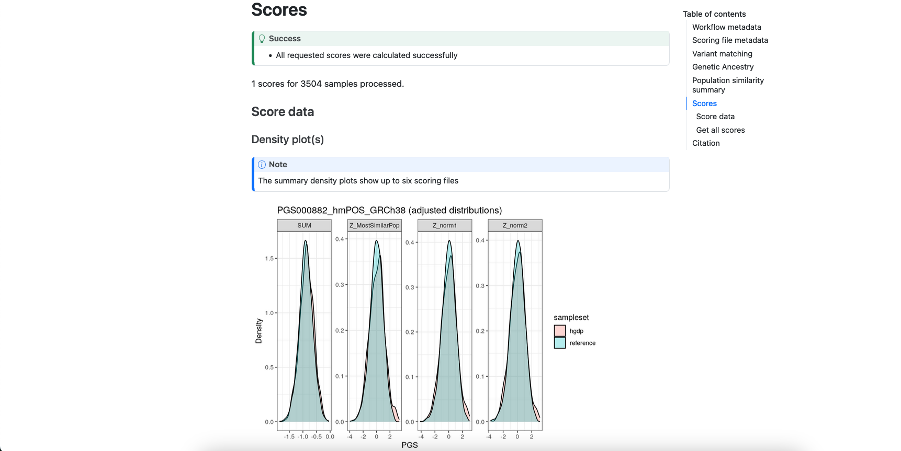

.. _interpret:

``pgsc_calc`` Outputs & report
==============================

The pipeline outputs are written to a results directory (``--outdir`` default is
``./results/``) with the following structure:

.. code-block:: console
                
    results
    ├── [sampleset] (directory with results for your data)
    │   ├── match (scoring files and variant match metadata)
    │   └── score (calculated PGS with summary report)
    └── pipeline_info (nextflow pipeline execution data)

``score/``
----------

Calculated scores are stored in a gzipped-text space-delimted text file called
``[sampleset]_pgs.txt.gz``. The data is presented in long form where each PGS for an individual is presented on a
seperate row (``length = n_samples*n_pgs``), and there will be at least four columns with the following headers:

- ``sampleset``: the name of the input sampleset, or ``reference`` for the panel.
- ``IID``: the identifier of each sample within the dataset.
- ``PGS``: the accession ID of the PGS being reported.
- ``SUM``: reports the weighted sum of *effect_allele* dosages multiplied by their *effect_weight*
  for each matched variant in the scoring file for the PGS.

If you have run the pipeline **without** using ancestry information the following columns may be present:

- ``DENOM``: the number of non-missing genotypes used to calculate the PGS for this individual.
- ``AVG``: normalizes ``SUM`` by the ``DENOM`` field (displayed when you calculate the PGS on a small sample size n<50
  to avoid using unreliable allele frequency estimates for missing genotypes in the target sample.

If you have run the pipeline **using ancestry information** (``--run_ancesty``) the following columns may be present
depending on the ancestry adjustments that were run (see :ref:`norm` for more details):

- ``percentile_MostSimilarPop``: PGS reported as a percentile of the distribution for the Most Similar Population
- ``Z_MostSimilarPop``: PGS reported as a Z-score in reference to the mean/sd of the Most Similar Population
- ``Z_norm1``: PGS adjusted to have mean 0 across ancestry groups (result of regressing *PGS ~ PCs*)
- ``Z_norm2``: PGS adjusted to have mean 0 and unit variance across ancestry groups (result of regressing
  *resid(PGS)^2 ~ PCs*)

Report
~~~~~~

A summary report is also provided for your samples (``report.html``). The report should open in a web browser and
contains useful information about the PGS that were applied, how well the variants in your target dataset match with the
reference panel and scoring files, a summary of the computed genetic ancestry data, and some simple graphs displaying
the distribution of scores in your dataset(s) as a density plot. Some of the sections are only displayed with
``--run_ancestry``, but we show them all here for reference.

The fist section of the report reproduces the nextflow command, and scoring file metadata (imported from the PGS Catalog
for each PGS ID) describing the scoring files that were applied to your sampleset(s):

.. figure:: screenshots/Report_1_Header.png
    :width: 600
    :alt: Example PGS Catalog Report: header sections

    **Figure 1. Example of pgsc_calc header.**

The next section reports how the variants in the target sampleset match the other data. The first table describes the
number of variants in the target dataset that overlap with the reference panel (*only present with* ``--run_ancestry``).
The second table provides a summary of the number and percentage of variants within each score that have been matched,
and whether that score passed the ``--min_overlap`` threshold (Passed Matching column) for calculation. The third
table provides a more detailed summary of variant matches broken down by types of variants (e.g., strand ambiguous,
multiallelic, duplicates) for the matched, excluded, and unmatched variants (see ``match/`` section for details):

.. figure:: screenshots/Report_2_VariantMatching.png
    :width: 600
    :alt: Example PGS Catalog Report: Variant matching/qc tables (summary & detailed)

    **Figure 2. Example of variant matching summaries in the pgsc_calc report.**

The next section describes the results of the genetic ancestry analysis of the target genotypes with the reference
panel data. It first displays a snippet of the ``[sampleset]_popsimilarity.txt.gz`` file for reference. A visual display
of the projection of the target data into the reference panel PCA space is plot for the first 6 PCs, where the target
samples are coloured according to the population that they are most similar to in the reference panel. A table
describing the distribution of ancestries within the reference panel and proportions of the target samples who are most
similar to those populations is also provided.

.. figure:: screenshots/Report_3_PCA.png
    :width: 600
    :alt: Example PGS Catalog Report: PCA plot of genetic ancestry data

    **Figure 3. Visualization of genetic ancestry analysis within the report.**

.. note:: It is important to visually inspect the PCA to make sure that it looks correct (placing the reference
    populations correctly), and that the projection of individuals from the target dataset looks sensible.

The final section shows an example of the main results dataframe that contains the sample identifiers and
calculated PGS in the *Score extract* section. A visual display of the PGS distribution for a set of example
score(s) (up to 6) is provided in the *Density plot* panel which can be helpful for looking at the distributions of the
scores in the target and reference dataset and how it changes for difference PGS adjustment methods:

    **Figure 4. Example of the** ``[sampleset]_pgs.txt.gz`` **table and plots of PGS distributions.**

``match/``
----------

This directory contains information about the matching of scoring file variants to your genotyping data (sampleset).
First a summary file (also displayed in the report) details whether each scoring file passes the minimum variant
matching threshold, and the types of variants that were included in the score:

.. list-table:: ``[sampleset]_summary.csv`` metadata
    :widths: 20, 20, 60
    :header-rows: 1

    * - Report Field
      - ``column_name``
      - Description
    * - Sampleset
      - ``dataset``
      - Name of the sampleset/genotyping data
    * - Scoring file
      - ``accession``
      - Name of the scoring file.
    * - Passed matching
      - ``score_pass``
      - True/False flag to indicate whether the scoring file passes the ``--min_overlap`` threshold
        and is included in the final scoring file.
    * - Match type
      - ``match_status``
      - Indicates whether the variants are matched (included in the final scoring file), excluded (matched but removed
        based on variant filters), or unmatched.
    * - Ambiguous
      - ``ambiguous``
      - True/False flag indicating whether the matched variants are strand-ambiguous (e.g. A/T and C/G variants).
    * - Multiallelic
      - ``is_multiallelic``
      - True/False flag indicating whether the matched variants are multi-allelic (multiple ALT alleles).
    * - Multiple potential matches
      - ``duplicate_best_match``
      - True/False flag indicating whether a single scoring file variant has multiple potential matches to the target genome.
        This usually occurs when the variant has no other/non-effect allele, and with variants that have different
        REF alleles.
    * - Duplicated matched variants
      - ``duplicate_ID``
      - True/False flag indicating whether multiple scoring file variants match a single target ID. This usually occurs
        when scoring files have been lifted across builds and two variants now point to the same position (e.g. rsID
        mergers).
    * - Matches strand flip
      - ``match_flipped``
      - True/False flag indicating whether the scoring file variant is originally reported on the opposite strand (and
        thus flipped to match)
    * - Variant in reference panel
      - ``match_IDs``
      - True/False flag indicating whether the variant from the scoring file that is matched in the target samples is
        also present in the variants that overlap with the reference population panel (required for PGS adjustment).
    * - n
      - ``count``
      - Number of variants with this combination of metadata (grouped by: ``[ match_status, ambiguous, is_multiallelic,
        duplicate_best_match, duplicate_ID, match_flipped, match_IDs]``
    * - %
      - ``percent``
      - Percent of the scoring file's variants that have the combination of metadata in count.

The log file is a :term:`CSV` that contains all possible matches for each variant in the combined input scoring files.
This information is useful to debug a score that is causing problems. Columns contain information about how each
variant was matched against the target genomes:

.. list-table:: ``[sampleset]_log.csv.gz`` metadata
    :widths: 20, 80
    :header-rows: 1

    * - ``column_name``
      - Description
    * - ``row_nr``
      - Line number of the variant with reference to the original scoring file (accession).
    * - ``accession``
      - Name of the scoring file.
    * - ``chr_name``
      - Chromosome name/number associated with the variant.
    * - ``chr_position``
      - Chromosomal position associated with the variant.
    * - ``effect_allele``
      - The allele that's dosage is counted (e.g. {0, 1, 2}) and multiplied by the variant's weight (effect_weight)
        when calculating score. The effect allele is also known as the 'risk allele'.
    * - ``other_allele``
      - The other non-effect allele(s) at the loci.
    * - ``effect_weight``
      - Value of the effect that is multiplied by the dosage of the effect allele (effect_allele) when
        calculating the score. Additional information on how the effect_weight was derived is in the weight_type
        field of the header, and score development method in the metadata downloads.
    * - ``effect_type``
      - Whether the dosage is calculated as additive ({0, 1, 2}), dominant ({0, 1}) or recessive ({0, 1}).
    * - ``ID``
      - Identifier of the matched variant.
    * - ``REF``
      - Matched variant: reference allele.
    * - ``ALT``
      - Matched variant: alternative allele.
    * - ``matched_effect_allele``
      - Which of the REF/ALT alleles is the effect_allele in the target dataset.
    * - ``match_type``
      - Record of how the scoring file variant ``effect_allele`` & ``other_allele`` match
        the REF/ALT orientation of the ID (e.g. *refalt* or *altref*), and whether the variant had to be strand-flipped
        to achieve a match (match_types ending with ``_flip``). If the non-effect allele (``other_allele``)
        is missing from the scoring file variant the ``match_type`` will be either (*no_oa_refalt* or *no_oa_altref*)
        and include information about whether it was flipped.
    * - ``is_multiallelic``
      - True/False flag indicating whether the matched variant is multi-allelic (multiple ALT alleles).
    * - ``ambiguous``
      - True/False flag indicating whether the matched variant is strand-ambiguous (e.g. A/T and C/G variants).
    * - ``match_flipped``
      - True/False flag indicating whether the matched variant is on the opposite strand (flipped).
    * - ``best_match``
      - True/False flag indicating whether this the best ``match_type`` for the current scoring file variant.
    * - ``exclude``
      - True/False flag indicating whether this matched variant is excluded from the final scoring file.
    * - ``duplicate_best_match``
      - True/False flag indicating whether a single scoring file variants has multiple potential matches to the target genome.
        This usually occurs when the variant has no other_allele, and with variants that have different REF alleles.
    * - ``duplicate_ID``
      - True/False flag indicating whether multiple scoring file variants match a single target ID.
    * - ``match_IDs``
      - True/False flag indicating whether the matched variant is also found in the reference panel genotypes.
    * - ``match_status``
      - Indicates whether the variant is *matched* (included in the final scoring file), *excluded* (matched but removed
        based on variant filters), *not_best* (a different match candidate was selected for this scoring file variant),
        or *unmatched*.
    * - ``dataset``
      - Name of the sampleset/genotyping data.

Processed scoring files are also present in this directory. Briefly, variants in the scoring files are matched against
the target genomes. Common variants across different scores are combined (left joined, so each score is an additional
column). The combined scores are then partially split to overcome PLINK2 technical limitations (e.g. calculating
different effect types such as dominant/recessive). Once scores are calculated from these partially split scoring
files, scores are aggregated to produce the final results in ``score/``.

``pipeline_info/``
------------------

Summary reports generated by nextflow describing the execution of the pipeline in
a lot of technical detail (see `nextflow tracing & visulisation`_ docs for more detail).
The execution report can be useful to see how long a job takes to execute, and how much
memory/cpu has been allocated (or overallocated) to specific jobs. The DAG is a visualization
of the pipline that may be useful to understand how the pipeline processes data and the ordering
of the modules.

.. _`nextflow tracing & visulisation`: https://www.nextflow.io/docs/latest/tracing.html
