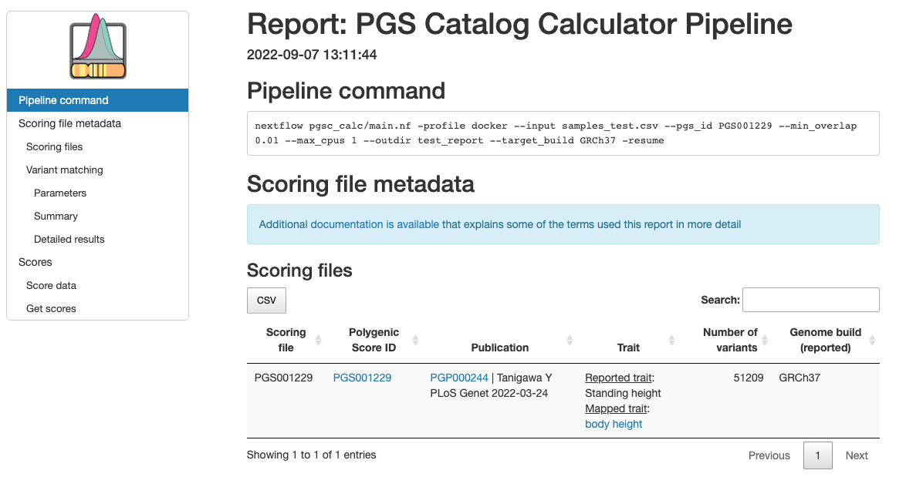
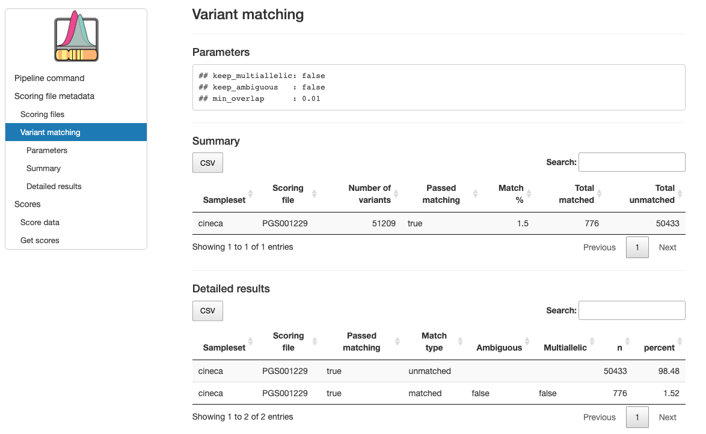
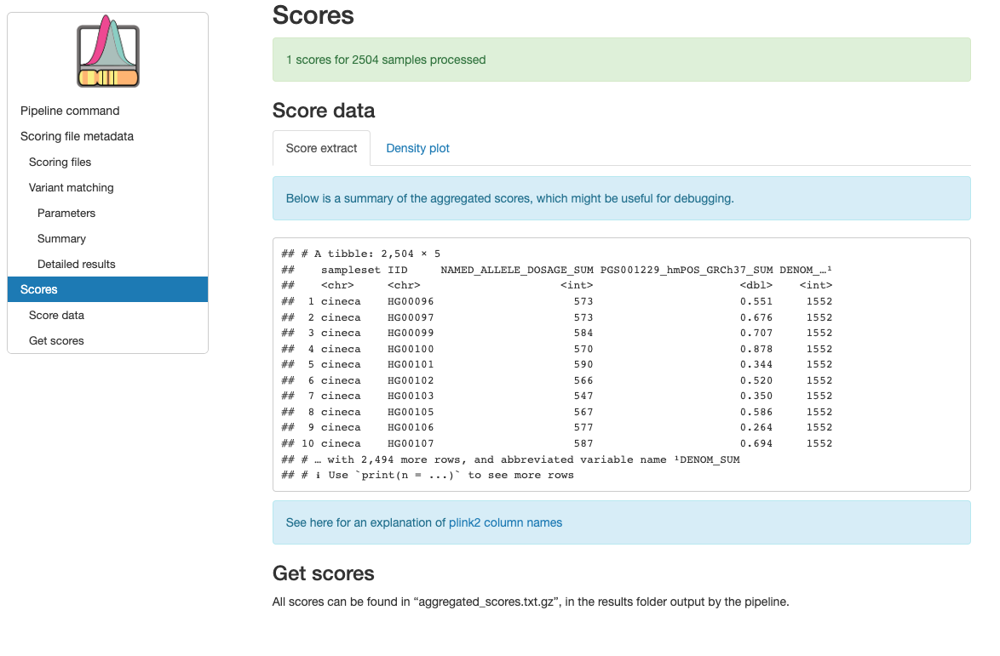

.. _interpret:

``pgsc_calc`` Outputs & Results
===============================

The pipeline outputs are written to a results directory
(``--outdir`` default is ``./results/``) that contains three subdirectories:

- ``score/``: calculated PGS with summary report
- ``match/`` : scoring files and variant match metadata
- ``pipeline_info/`` : nextflow pipeline execution (memory, runtime, etc.)

``score/``
----------

Calculated scores are stored in a gzipped-text space-delimted text file called
``aggregated_scores`` that is labelled with the date/time (e.g. ``aggregated_scores_YYYY_MM_DD_HH_MM_SS.txt.gz``).
Each row represents an individual, and there should be at least three columns with the following headers:

- ``dataset``: the name of the input sampleset
- ``IID``: the identifier of each sample within the dataset
- ``[PGS NAME]_SUM``: reports the weighted sum of *effect_allele* dosages multiplied by their *effect_weight*
  for each matched variant in the scoring file. The column name will be different depending on the scores
  you have chosen to use (e.g. ``PGS000001_SUM``).

At least one score must be present in this file (the third column). Extra columns might be
present if you calculated more than one score, or if you calculated the PGS on a dataset with a
small sample size (n < 50, in this cases a column named ``[PGS NAME]_AVG`` will be added that
normalizes the PGS using the number of non-missing genotypes to avoid using allele frequency data
from the target sample).

Report
~~~~~~

A summary report is also available (``report.html``). The report should open in
a web browser and contains useful information about the PGS that were applied,
how well the variants match with the genotyping data, and some simple graphs
displaying the distribution of scores in your dataset(s) as a density plot.

The fist section of the report reproduces the nextflow command, and metadata (imported
from the PGS Catalog for each PGS ID) describing the scoring files that were applied
to your sampleset(s):

Within the scoring file metadata section are two tables describing how well the variants within
each scoring file match with target sampleset(s). The first table provides a summary of the
number and percentage of variants within each score that have been matched, and whether that
score passed the ``--min_overlap`` threshold (Passed Matching column) for calculation. The second
table provides a more detailed summary of variant matches broken down by types of variants (strand ambiguous,
multi-allelic, duplicates) for the matched, excluded, and unmatched variants (see ``match/`` section for details):

The final section shows an example of the results table that contains the sample identifiers and
calculated PGS in the *Score extract* panel. A visual display of the PGS distribution for a set of example
score(s) (up to 6) is provided in the *Density plot* panel which can be helpful for looking at the distributions in
multiple dataset(s):

``match/``
----------

This directory contains information about the matching of scoring file variants to
the genotyping data (samplesets). First a summary file (also displayed in the report)
details whether each scoring file passes the minimum variant matching threshold, and
the types of variants that were included in the score:

.. list-table:: ``[sampleset]_summary.csv`` metadata
    :widths: 20, 20, 60
    :header-rows: 1

    * - Report Field
      - ``column_name``
      - Description
    * - Sampleset
      - ``dataset``
      - Name of the sampleset/genotyping data
    * - Scoring file
      - ``accession``
      - Name of the scoring file.
    * - Passed matching
      - ``score_pass``
      - True/False flag to indicate whether the scoring file passes the ``--min_overlap`` threshold
        and is included in the final scoring file.
    * - Match type
      - ``match_status``
      - Indicates whether the variant is matched (included in the final scoring file),
        excluded (matched but removed based on variant filters), or unmatched.
    * - Ambiguous
      - ``ambiguous``
      - True/False flag indicating whether the matched variant is strand-ambiguous (e.g. A/T and C/G variants).
    * - Multiallelic
      - ``is_multiallelic``
      - True/False flag indicating whether the matched variant is multi-allelic (multiple ALT alleles).
    * - Multiple Potential Matches
      - ``duplicate_best_match``
      - True/False flag indicating whether a single scoring file variants has multiple potential matches to the target genome.
        This usually occurs when the variant has no other_allele, and with variants that have different REF alleles.
    * - Duplicated Matched Variants
      - ``duplicate_ID``
      - True/False flag indicating whether multiple scoring file variants match a single target ID. This usually occurs
        when scoring files have been lifted across builds and two variants now point to the same position (e.g. rsID mergers).
    * - N
      - ``count``
      - Number of variants with this combination of metadata (grouped by: ``[ match_status, ambiguous, is_multiallelic,
        duplicate_best_match, duplicate_ID]``
    * - percent
      - ``percent``
      - Percent of the scoring file's variants that have the combination of metadata in count.

The log file is a :term:`CSV` that contains all possible matches
for each variant in the combined input scoring files. This information is useful to debug a
score that is causing problems. Columns contain information about how each
variant was matched against the target genomes:

.. list-table:: ``[sampleset]_log.csv.gz`` metadata
    :widths: 20, 80
    :header-rows: 1

    * - ``column_name``
      - Description
    * - ``row_nr``
      - Line number of the variant with reference to the original scoring file (accession).
    * - ``accession``
      - Name of the scoring file.
    * - ``chr_name``
      - Chromosome name/number associated with the variant.
    * - ``chr_position``
      - Chromosomal position associated with the variant.
    * - ``effect_allele``
      - The allele that's dosage is counted (e.g. {0, 1, 2}) and multiplied by the variant's weight (effect_weight)
        when calculating score. The effect allele is also known as the 'risk allele'.
    * - ``other_allele``
      - The other non-effect allele(s) at the loci.
    * - ``effect_weight``
      - Value of the effect that is multiplied by the dosage of the effect allele (effect_allele) when
        calculating the score. Additional information on how the effect_weight was derived is in the weight_type
        field of the header, and score development method in the metadata downloads.
    * - ``effect_type``
      - Whether the dosage is calculated as additive ({0, 1, 2}), dominant ({0, 1}) or recessive ({0, 1}).
    * - ``ID``
      - Identifier of the matched variant.
    * - ``REF``
      - Matched variant: reference allele.
    * - ``ALT``
      - Matched variant: alternative allele.
    * - ``matched_effect_allele``
      - Which of the REF/ALT alleles is the effect_allele in the target dataset.
    * - ``match_type``
      - Record of how the scoring file variant ``effect_allele`` & ``other_allele`` match
        the REF/ALT orientation of the ID (e.g. *refalt* or *altref*), and whether the variant had to be strand-flipped
        to achieve a match (match_types ending with ``_flip``). If the non-effect allele (``other_allele``)
        is missing from the scoring file variant the ``match_type`` will be either (*no_oa_refalt* or *no_oa_altref*)
        and include information about whether it was flipped.
    * - ``is_multiallelic``
      - True/False flag indicating whether the matched variant is multi-allelic (multiple ALT alleles).
    * - ``ambiguous``
      - True/False flag indicating whether the matched variant is strand-ambiguous (e.g. A/T and C/G variants).
    * - ``duplicate_best_match``
      - True/False flag indicating whether a single scoring file variants has multiple potential matches to the target genome.
        This usually occurs when the variant has no other_allele, and with variants that have different REF alleles.
    * - ``duplicate_ID``
      - True/False flag indicating whether multiple scoring file variants match a single target ID.
    * - ``match_status``
      - Indicates whether the variant is matched (included in the final scoring file), excluded (matched but removed
        based on variant filters), not_best (a different match candidate was selected for this scoring file variant),
        or unmatched.
    * - ``dataset``
      - Name of the sampleset/genotyping data.

Processed scoring files are also present in this directory. Briefly, variants in
the scoring files are matched against the target genomes. Common variants across
different scores are combined (left joined, so each score is an additional
column). The combined scores are then partially split to overcome PLINK2
technical limitations (e.g. calculating different effect types such as dominant
/ recessive). Once scores are calculated from these partially split scoring
files, scores are aggregated to produce the final results in ``score/``.

``pipeline_info/``
------------------

Summary reports generated by nextflow describing the execution of the pipeline in
a lot of technical detail (see `nextflow tracing & visulisation`_ docs for more detail).
The execution report can be useful to see how long a job takes to execute, and how much
memory/cpu has been allocated (or overallocated) to specific jobs. The DAG is a visualization
of the pipline that may be useful to understand how the pipeline processes data and the ordering
of the modules.

.. _`nextflow tracing & visulisation`: https://www.nextflow.io/docs/latest/tracing.html
